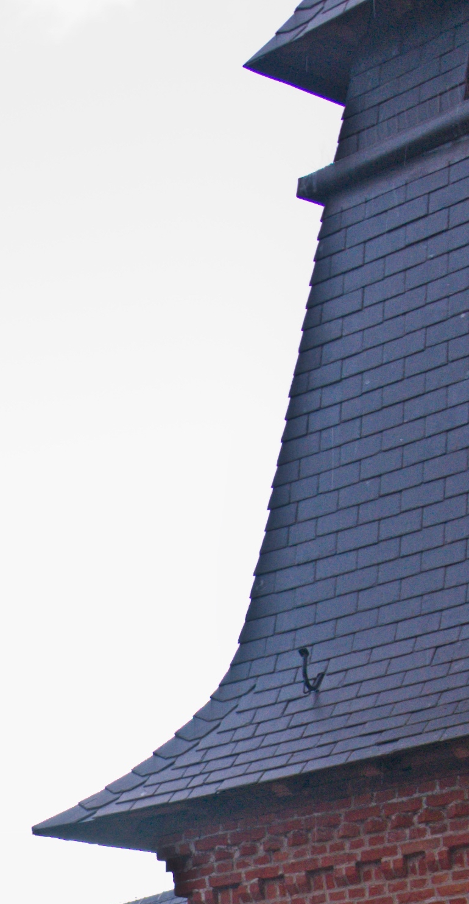

# Notes on Picktorial

I really like the picktorial application because of the advanced selective adjustments and the Photos.app extension. But there is one thing that keeps me away from using Picktorial and that is its shadow & hightlight recovering flaws. Have a look at the following images to understand what I mean.

This is an image where I recovered highlights & shadows using Picktorial

Notice the ugly banding around high contrast edges:

Now look at how Adobe Camera Raw renders the same image with comparable shadow & higlight adjustments:

Here is a side by side view of one detail of the above images:

| Picktorial                                                   | Adobe camera raw                                   |
| ------------------------------------------------------------ | -------------------------------------------------- |
|  |  |

Here is another example.

Picktorial shadow recovery:

The banding appears again:

And no banding when using Adobe Camera raw:

