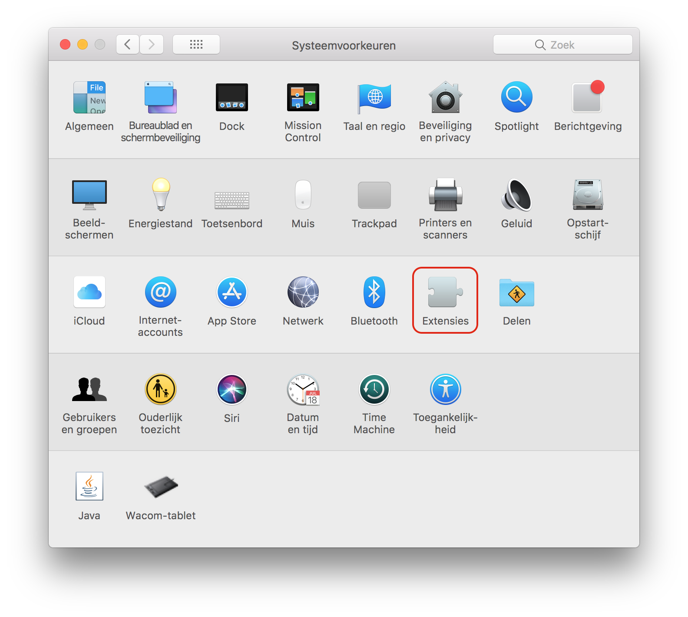
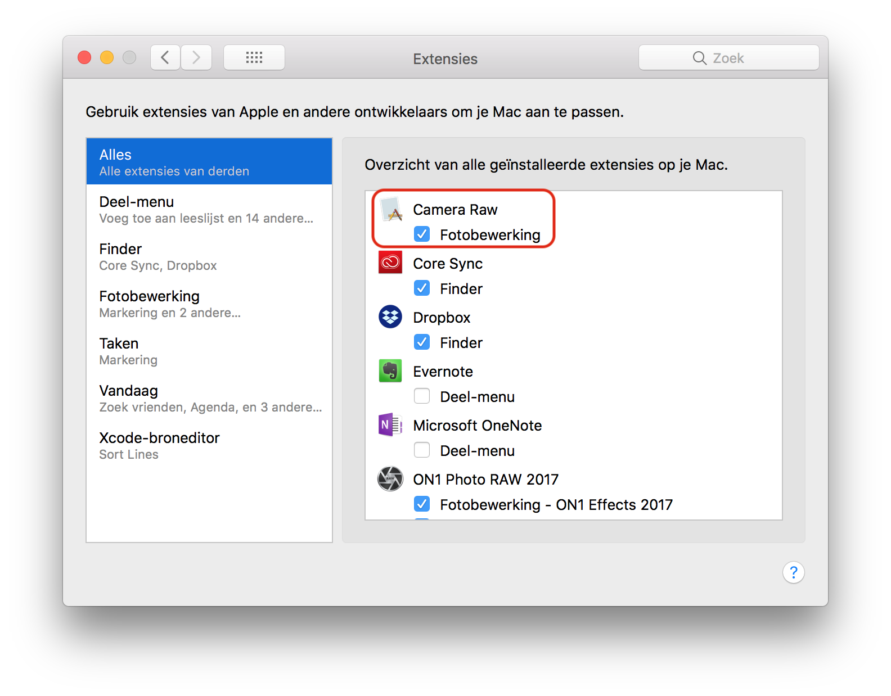
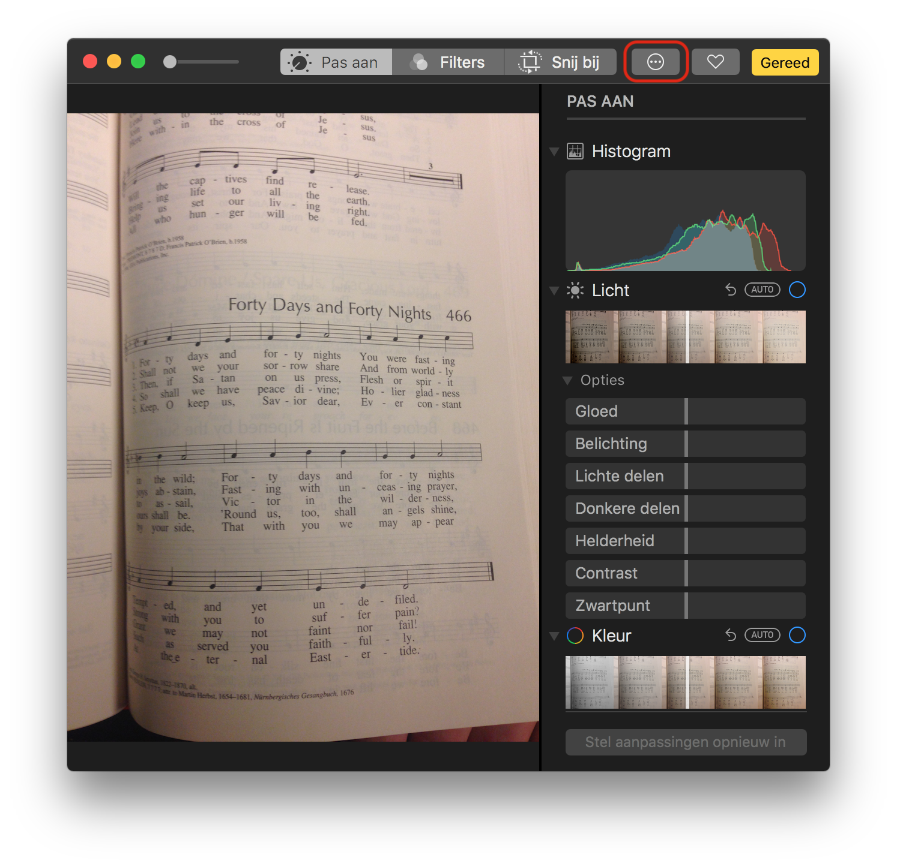
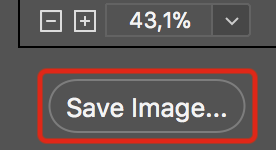
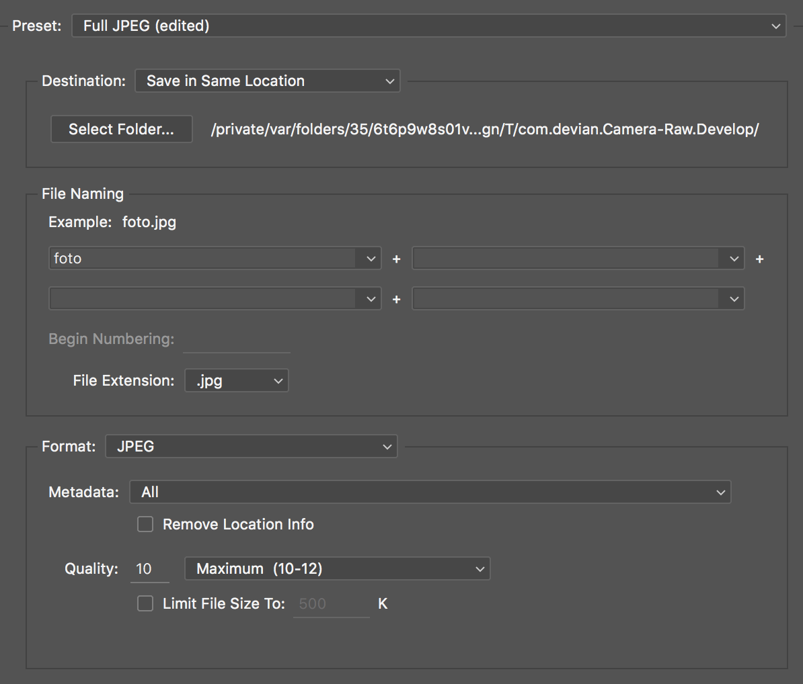

## Installation

1. Open the "Camera Raw" application.

2. Quit the "Camera Raw" application.

3. Open the "System Preferences" application.

4. Click the "Extensions" preference pane

5. Enable the "Camera Raw" photo editing extension

6. Quit "System Preferences"

7. Open the "Photos" app and select one photo.

8. Click `Edit` 

9. Click the `…` extensions button

10. Click `Develop`

11. Develop your photo

12. Click `Save image…` in the bottom left corner

    

13. Setup camera RAW plugin to save in the correct format

    1. In the `Destination:` dropbox select: `Save in Same Location`
    2. In the file naming text field, type: `foto`
    3. In the `Format` dropbox select: `JPEG`

    

14. Click `Save`

15. Click `Done`

16. Go back to the "Photos" application and click `Done`